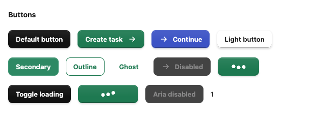
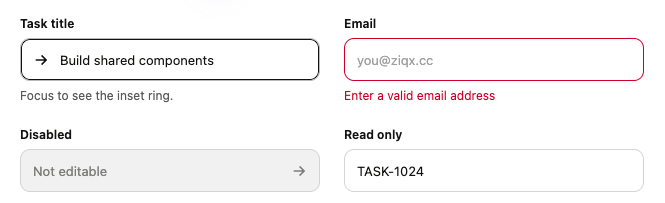
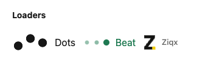
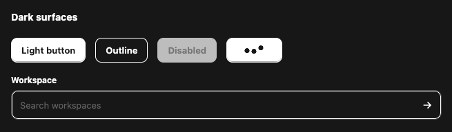

# @ziqx/react-comps

Shared, TSX-first React components for Ziqx products. Includes `Button`, `Input`, `DotsLoader`, `BeatLoader`, and the existing branded `ZiqxLoader`. React is the only runtime peer dependency; no Tailwind, Next.js, icon library, or animation runtime is required.

## Use

Install this local package in a product while developing:

```sh
npm install /Users/fathah/Desktop/ziqx/packages/ziqx-react-comps
```

Import the stylesheet once in your app entry or root layout:

```tsx
import "@ziqx/react-comps/styles.css";
import { Button, Input, BeatLoader } from "@ziqx/react-comps";
import { ArrowRight, Plus, Mail } from "lucide-react";

export function TaskForm({ saving }: { saving: boolean }) {
  return (
    <form>
      <Input
        label="Email"
        name="email"
        type="email"
        placeholder="you@company.com"
        prefix={Mail}
        required
      />
      <Button
        type="submit"
        bgColor="#07815d"
        fgColor="#ffffff"
        prefix={Plus}
        suffix={ArrowRight}
        loading={saving}
        loadingLabel="Creating task…"
      >
        Create task
      </Button>
      <BeatLoader label="Syncing…" />
    </form>
  );
}
```

Lucide is optional and belongs to the consuming app. Pass an icon **component** (`prefix={Plus}`), not an element (`prefix={<Plus />}`). Icons receive `color={fgColor}`, `size={18}`, a class name, and `aria-hidden`. Their rendered root should forward those props and use `currentColor`, so disabled colors follow the surrounding component. Prefix and suffix icons are decorative; give icon-only buttons an `aria-label`.

## Button



- `bgColor`, `fgColor`: any valid CSS color, including `var(--brand)`. Defaults: `#101010` / `#ffffff`.
- `variant`: `primary` (raised Tasks finish), `secondary` (softened fill), `outline`, or `ghost`. Defaults to `primary`.
- `size`: `default`, `compact`, or `icon`.
- `prefix`, `suffix`: icon components.
- `loading`, `loadingLabel`: controlled loading state; shows DotsLoader, disables activation, announces the loading label, and preserves the original content's dimensions. Set `loading` for the duration of your request; there are no automatic timers. Loading retains the active colors.
- `disabled`: derives muted background, foreground, and border colors from your colors. `aria-disabled` also blocks click activation while allowing keyboard focus.
- `full`: fills the available width.
- Native button props, event handlers, `className`, `style`, and a forwarded button `ref` are supported. `type` defaults to `button`; use `submit` explicitly for forms.

Hover, pressed, border, focus, and disabled states are derived in CSS using `color-mix()`. No color parsing, palette object, or per-render JavaScript color calculation is needed. `fgColor` stays the text/icon color in every variant. For an outlined green button on a light surface, use `variant="outline" bgColor="#ffffff" fgColor="#07815d"`. Choose legible foreground/background pairs; the package does not automatically calculate contrast.

## Input



The Tasks input geometry: 43px height, 10px corners, 12px horizontal padding, and a 200ms border/inset-ring transition. The focus ring grows inward without shifting text or changing the layout.

- `bgColor`, `fgColor`: defaults `#ffffff` / `#11110f`; focus uses `fgColor` and neutral states derive from the pair.
- `label`, `description`, `error`: optional accessible field content. IDs connect the label and descriptions to the native input; errors set `aria-invalid` and a red border/ring.
- `prefix`, `suffix`: decorative icon components, with automatic padding.
- All native input props, including `value`, `defaultValue`, `onChange`, `name`, `required`, `readOnly`, `disabled`, and a forwarded input `ref`.
- `className` and `style` target the native input; `containerClassName` targets the field wrapper. Without `label`, supply `aria-label` or an external label.

The component does not mirror values into state and works with controlled inputs, uncontrolled inputs, native forms, and ref-based form libraries. Intended for text-like input types, including email, password, search, number, and URL; checkbox, radio, range, file controls, and date-picker UI are outside this release.

## Loaders



```tsx
import { DotsLoader, BeatLoader, ZiqxLoader } from "@ziqx/react-comps/loaders";

<DotsLoader size="sm" label="Saving…" />;
<BeatLoader
  showLabel
  label="Syncing…"
  style={{ color: "#07815d", "--ziqx-loader-cycle": "1200ms" }}
/>;
<ZiqxLoader label="Loading workspace…" />;
```

All three support `size="sm" | "md" | "lg"`, `tone="default" | "inverse"`, `label`, `showLabel`, `className`, and `style`. Colors inherit by default. CSS variables `--ziqx-loader-color`, `--ziqx-loader-width`, and `--ziqx-loader-cycle` customize appearance and timing. `ZiqxLoader` shows its label by default; the dot loaders do not. Standalone loaders expose `role="status"`; button loaders are hidden from assistive technology because the button supplies the progress name.

## Styles and compatibility



Every component has scoped `ziqx-*` styles, reduced-motion handling, and forced-colors support. React 18.2+ and React 19 are supported. Use a modern browser with CSS `color-mix()` support. Fonts inherit from your product.

For smaller CSS imports, use component entry points:

```tsx
import { Button } from "@ziqx/react-comps/button";
import "@ziqx/react-comps/button/styles.css"; // includes button DotsLoader CSS
import { Input } from "@ziqx/react-comps/input";
import "@ziqx/react-comps/input/styles.css";
import "@ziqx/react-comps/loaders/styles.css"; // all standalone loaders
```

Prefer either the combined stylesheet or the required component styles. Source `.tsx` files and generated ESM/declaration files are shipped. Client directives are preserved for Next.js. CommonJS `require()` is not a supported entry point.

## Development

```sh
npm install
npm run check
npm pack --dry-run
```

`check` runs strict source types, build, component rendering tests, consumer types (including CSS imports), and formatting. `npm pack` rebuilds the ESM and declaration output. Component folders and subpath exports can be extended for future date pickers, dropdowns, and other shared controls.
